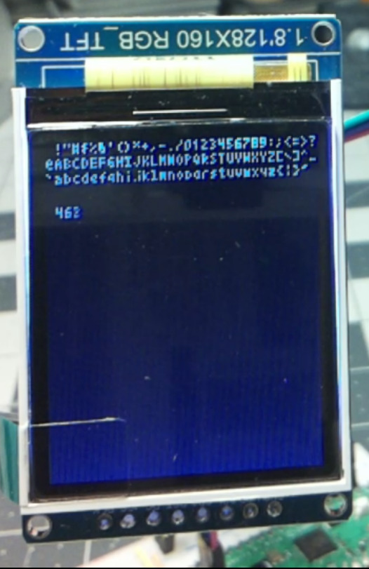

ST7735S/R/B driver in Ada

I wrote the spec and board support, Claude did the rest of the implementation.
I have no idea what that means for copyright/licensing, though I think it
copied mostly from Adafruit's MIT-licensed driver. It works for me on a 1.8"
128x160 green tab module, Claude left comments on how to configure for the
others but apparently vendors don't always use the correct color tab, so you
might have to try a few different configs to figure out what you actually have.

The [test/src/board.adb](test/src/board.adb) implementation uses the `RP.SPI`
driver in blocking mode. This could be replaced with `RP.DMA` to save CPU
cycles.
